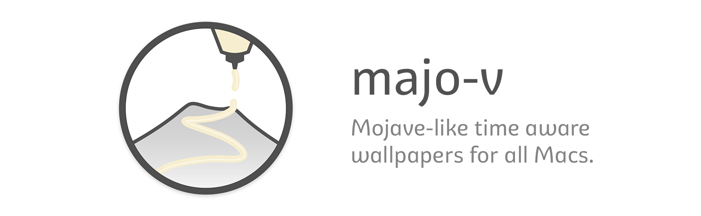
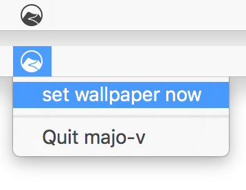

<p align="center">
  <a href="https://github.com/r4lv/majo-v/releases"></a>
  
  
  
</p>

Have you seen the amazing dynamic wallpapers on the new macOS 10.14 Mojave? Mojave calculates the position of the sun for your current time and location, compares them to the 16 images inside `Mojave (Dynamic).heic` and displays the one closest to your constellation as wallpaper.

*majo-v* is a proof of concept to achieve the same, on all Macs, in ~100 lines of python.


## Installation

The recommended way of installing *majo-v* is with [pipsi](https://github.com/mitsuhiko/pipsi), but you can also use pip:

``` bash
pipsi install git+https://github.com/r4lv/majo-v#egg=majo-v
# or
pip3 install git+https://github.com/r4lv/majo-v#egg=majo-v
```

Note that *majo-v* requires python 3.4+.


## Usage

To use *majo-v*, you need a folder with a bunch of images inside. You can put there as many as you want (e.g. the [original 16 images from macOS Mojave](https://technastic.com/macos-mojave-dynamic-wallpapers/)), as long as you rename the files based on the *time of the day they should appear first*, in the format `HH_MM.jpg`, e.g. `06_00.jpg` for an image which is to be displayed after 6am, `08_30.jpg` for an image displayed after 8:30, and so on. You then pass the folder as command line argument to *majo-v*, which chooses the most fitting image, and sets it as wallpaper on all your screens.

``` text
Usage: majo-v [--version] [--dry-run|--gui] [--current-time 'HH:MM'] FOLDER

  Set the most fitting image from the given folder as wallpaper.

  FOLDER contains a set of jpg images, where the filenames are named after
  the time of the day where they should appear first, in the format
  'HH_MM.jpg', e.g. '06_00.jpg' for an image which is to be displayed after
  6am, '08_30.jpg' for an image displayed after 8:30, and so on.

Options:
  --version               Show version information.
  -n, --dry-run           Do nothing, just show which wallpaper would be set.
  -g, --gui               Start as menu bar app and update wallpaper automatically.
  --current-time 'HH:MM'  Overwrite time used for selecting the most fitting image.
  --help                  Show this message and exit.
```

- by default, *majo-v* sets the wallpaper and exits. For a more Mojave-like experience, start *majo-v* with the `--gui` switch, which starts a menu bar app. The menu bar app watches the current time in the background, and updates the wallpaper whenever necessary. Use `&` to detach *majo-v* from your terminal:
   ``` bash
   majo-v --gui ~/Pictures/Mojave-Wallpaper &
   ```
   
- The `--dry-run` option does not actually change the wallpaper, just prints out the image it would use.
- You can override the current time by using the `--current-time HH_MM` option, to force a specific wallpaper. Useful in combination with `--dry-run`, to check what *majo-v* does.


## Internals

#### dependencies

*majo-v* depends on

- [click](https://click.palletsprojects.com), for the command line interface
- [pyobjc-core](https://pythonhosted.org/pyobjc/), for calling the macOS APIs
- [rumps](https://github.com/jaredks/rumps), for the menu bar interface
- [pendulum](https://pendulum.eustace.io), for handling date and time


#### (no) HEIC support

MacOS 10.14 Mojave's dynamic desktop feature uses single `.heic` files which contain a sequence of 16 images, together with metadata (altitude & azimuth of the sun in every image, and index of the default *dark* and *light* images when dynamic mode is disabled). I found no way of extracting the images on macOS version before Mojave (metadata can be extracted with 10.13 High Sierra), so you sadly cannot use `.heic` files with *majo-v*


#### (no) sun position calculation

This would be quite feasable, but I think the gain is little. Just rename your files in winter, so that the sunrise matches again ;)


#### Retina menu bar icon

The `menubar.tiff` contains two versions of the icon, so it looks good on retina too. The icons were created with these parameters:

- `menubar.png`, 20×20px
  - 15×15px circle shape with 1px centered stroke
  - 1px padding at the top, 2px padding at the bottom
- `menubar@2x.png`, 40×40px
  - 30×30px circle shape with 2px centered stroke
  - 4px padding at top and bottom

…and then combined to a single `menubar.tiff` with
``` bash
tiffutil -cathidpicheck menubar.png menubar@2x.png -out menubar.tiff
```

No need to compress the `.png`s, as the `.tiff` stores the pixel values only.


#### Multiple spaces

By design of macOS, one cannot set a wallpaper for all spaces at once. To come around this limitation, *majo-v* watches if you change the active space (by listening to `NSWorkspaceActiveSpaceDidChangeNotification`) and applies the correct wallpaper. *majo-v* has to be started with `--gui` for this, so that it can sit in the menu bar and watch.


## Further Reading

- [pysolar](https://github.com/pingswept/pysolar) could be used to calculate the current sun position
- [xtai/mojave-dynamic-heic](https://github.com/xtai/mojave-dynamic-heic) also has the extracted jpg from `Mojave (Dynamic).heic`
- [nshipster.com](https://nshipster.com/macos-dynamic-desktop/) has a nice nerdy article about dynamic wallpapers, CoreGraphics and HEIC. They also implemented a [solar position calculation](https://github.com/NSHipster/DynamicDesktop/blob/master/SolarPosition.playground/Sources/SolarPosition.swift) in Swift
- [pipwerks/OS-X-Wallpaper-Changer](https://github.com/pipwerks/OS-X-Wallpaper-Changer/) does something similar, but with applescript and just 6 wallpapers/day
- [sindresorhus/macos-wallpaper](https://github.com/sindresorhus/macos-wallpaper/blob/master/Sources/wallpaper/Wallpaper.swift) has some more sophisticated handling of `NSWorkspace.shared.setDesktopImageURL` and companions
